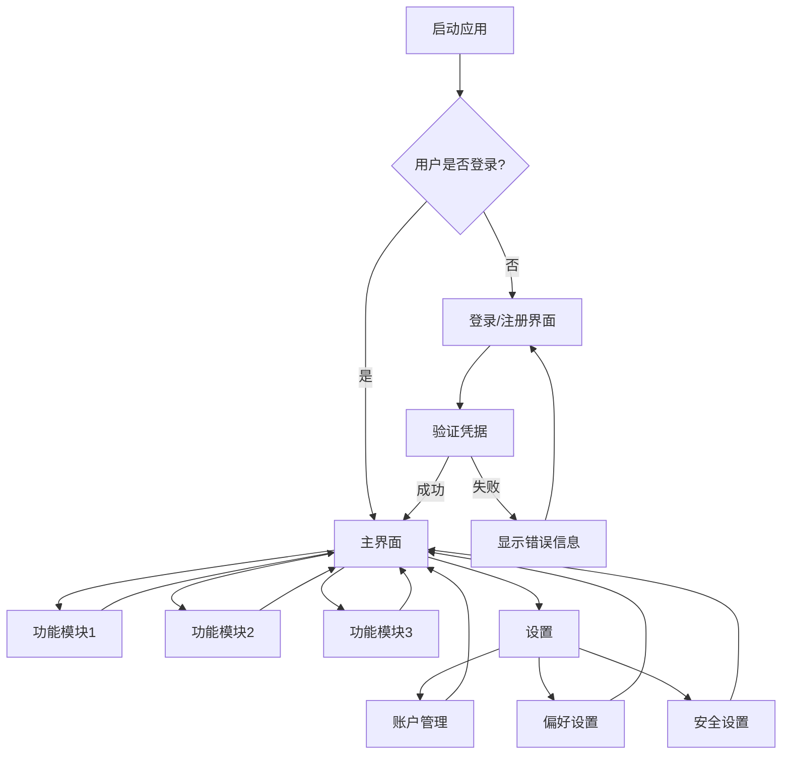

# [应用名称] 流程文档

## 1. [用户引导与账户管理]

[描述应用的首次用户体验，包括注册、登录、身份验证和退出流程。应涵盖新用户和回访用户的完整路径。]

> 示例：
> 当新用户首次访问[应用名称]时，他们会看到一个简洁明了的着陆页，提供注册或登录选项。注册过程要求用户输入[必要信息，如电子邮件地址和密码]，然后通过[验证方式]确认身份。为增强安全性，应用引导用户完成[安全设置，如多因素认证]。除基本注册外，用户还可以选择使用[可选的第三方登录方式]登录。回访用户可以使用已有凭据登录，忘记密码的用户可以通过明显的链接启动密码恢复流程。登出选项在所有页面上都清晰可见，确保用户可以安全地结束会话。

## 2. [核心界面展示]

[描述用户成功认证后看到的主界面，包括总体布局、关键元素和导航结构。]

> 示例：
> 用户成功登录后，进入作为所有活动中心的[主界面名称]。页面设计清晰，[描述导航结构，如顶部导航栏、侧边菜单等]，允许用户浏览不同模块，如[主要功能模块列表]。默认视图显示个性化的关键指标，包括[重要数据指标列表]。界面设计突出[设计重点，如简约性、直观性等]，确保各类用户都能轻松导航和操作。

## 3. [关键功能流程]

[描述主要功能模块的详细工作流程，包括用户如何从一个功能切换到另一个功能，以及不同页面之间的转换体验。]

> 示例：
> 从[主界面名称]出发，用户可以逐一深入特定功能。
> 
> 在[功能模块1]中，用户通过[操作方式]完成[主要任务]。具体步骤包括[步骤描述]，系统会[响应动作]。
> 
> [功能模块2]提供[功能描述]，用户可以[用户操作]来[实现目标]。数据呈现通过[数据可视化方式]展示，包括[指标类型]。
> 
> [功能模块3]允许用户[核心功能描述]，支持[支持的操作类型]。
> 
> 各页面之间的转换通过[导航元素]实现，确保用户可以在不同功能间自由切换而不影响工作流程。

## 4. [配置与个性化]

[描述用户如何管理个人信息、偏好设置和应用配置的流程。]

> 示例：
> 设置区域让用户完全控制个人信息和偏好。用户可以[管理个人资料的方式]、[安全设置选项]以及配置[通知偏好选项]。
> 
> 用户还可以通过[个性化设置选项]来定制体验，包括[自定义选项列表]。对于需要管理[特殊功能，如订阅或支付]的用户，此部分提供[相关管理选项]。
> 
> 完成设置更改后，用户可以通过[导航方式]返回主界面，确保整体使用体验的连贯性。

## 5. [异常处理机制]

[描述应用如何处理错误情况、用户输入错误或系统故障，以及为用户提供的备选路径。]

> 示例：
> 整个用户旅程中，应用设计了强大的错误处理和应急措施。当出现[常见错误情况]时，系统会[错误响应方式]，并[提供解决指导]。
> 
> 如遇[系统异常情况]，用户会收到[反馈方式]，清晰说明[问题性质]并建议[可选操作]。
> 
> 对于[权限相关问题]，系统采用[处理机制]，确保用户体验的连续性和数据的安全性。

## 6. [用户体验总结]

[总结应用的整体用户旅程，强调主要路径和关键功能之间的联系，以及应用如何实现其业务目标。]

> 示例：
> [应用名称]引导用户完成从首次访问到日常使用的清晰、直观的旅程。从[初始体验]开始，用户迅速熟悉[核心功能区域]。
> 
> 每个核心功能——从[功能1]、[功能2]到[功能3]——都设计得易于访问和导航。[重要体验要素]确保用户可以[实现核心业务目标]。
> 
> 应用的整体设计和流程旨在[核心价值主张]，通过[关键实现方式]为用户提供价值。

## 7. [流程可视化]

[在此部分插入关键流程的流程图、用户旅程图或页面转换图，帮助理解整体应用流程。]



> 示例：[特定流程名称]
> ```mermaid
> flowchart TD
>     A[用户操作起点] --> B{决策点1?}
>     B -->|选择1| C[步骤1]
>     B -->|选择2| D[步骤2]
>     C --> E[下一步骤]
>     D --> E
>     E --> F{决策点2?}
>     F -->|选择1| G[分支1]
>     F -->|选择2| H[分支2]
>     G --> I[结果1]
>     H --> J[结果2]
> ```

## 8. [用户角色与权限]

[如果应用有不同用户角色，描述各角色的流程差异和特定功能。]

> 示例：
> ### [角色1]流程
> [角色1]登录后，可以访问[专属功能列表]。在[特定场景]中，[角色1]可以[特定操作]，而其界面强调[关键元素]。
> 
> ### [角色2]流程
> [角色2]专注于[主要职责]，其仪表盘显示[相关指标]。权限范围包括[权限描述]，主要工作流程涉及[工作流程描述]。
> 
> ### [角色3]流程
> [角色3]的使用体验侧重于[体验重点]，界面设计突出[设计要点]，确保[实现目标]。

## 9. [技术特性与考量]

[描述应用的特殊功能、技术实现要点或其他重要考虑，如离线功能、数据同步、性能优化等。]

> 示例：
> 应用设计了[特殊功能描述]，即使在[挑战条件]下也能[实现目标]。当出现[特殊情况]时，系统会[响应机制]。
> 
> [技术特性]通过[实现方式]提供[用户价值]，整个过程对用户[体验特点]，同时确保[重要保障]。
> 
> 考虑到[特殊场景]，应用还提供了[附加功能]，通过[实现手段]解决[潜在问题]。 