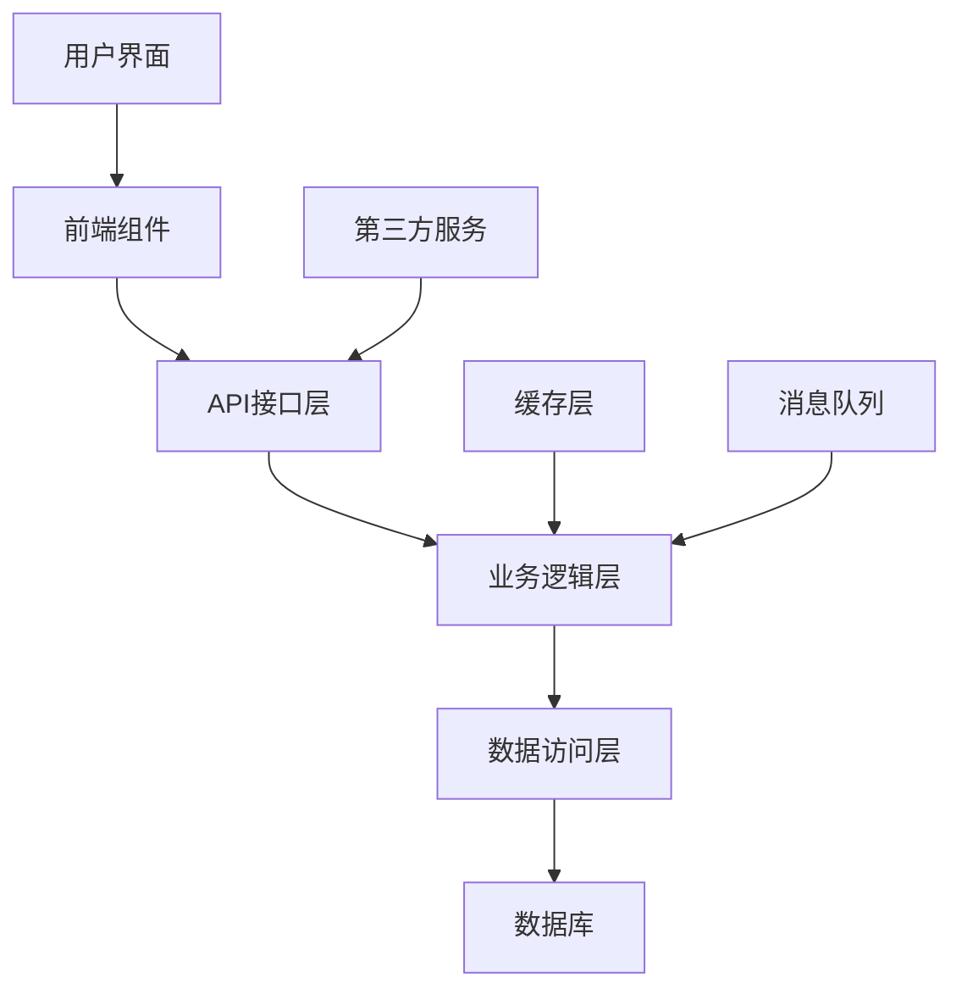
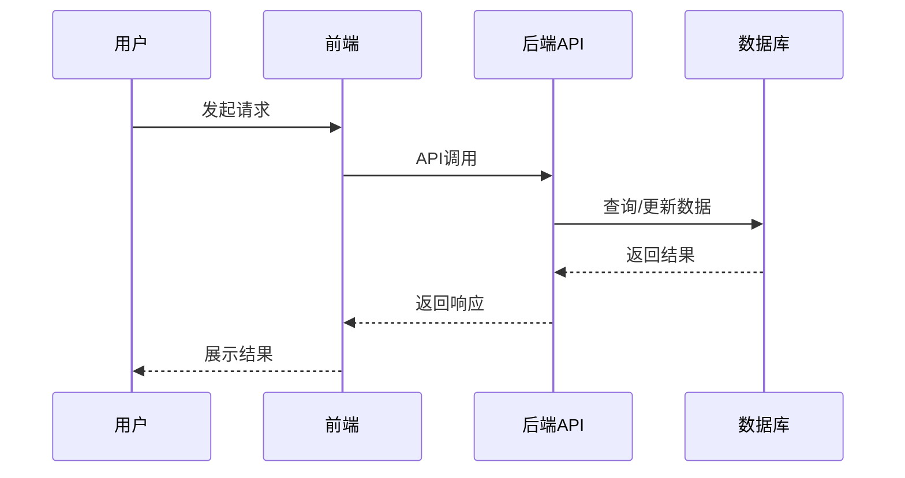
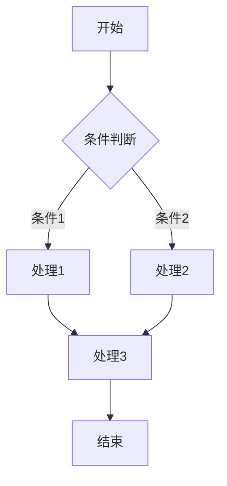
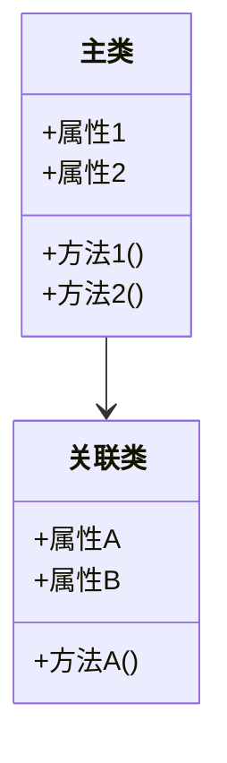

# 产品需求文档 (PRD) 模板

## 1. 产品概述

### 1.1 背景
[描述产品开发的背景、市场需求、竞品分析等。]

> 示例：
> * 系统需要一个统一的用户管理模块
> * 现有用户系统功能分散，维护成本高
> * 缺乏统一的用户权限和角色管理
> * 用户数据安全性需要提升
> * 市场上同类产品存在A、B、C等缺点，我们的产品将解决这些问题

### 1.2 产品定位
[在此处简要描述产品的整体定位、愿景和解决的核心问题。包括产品名称、核心功能、目标用户和总体价值主张。大约3-5段文字，清晰传达产品的本质和目的。]

> 示例：用户管理中心是一个专为企业内部系统和多平台应用设计的统一用户身份与权限管理平台。该系统整合了用户认证、权限管理、单点登录、安全策略和用户行为分析等核心功能，通过直观的界面和强大的API集成能力，使开发团队和管理人员能够统一管理所有应用系统的用户访问权限。

### 1.3 业务目标
[此处描述产品的商业目标和成功衡量指标，包括解决什么问题、为谁解决、如何衡量成功。]

> 示例：该项目旨在帮助企业解决账号分散、权限混乱和安全风险等问题，通过自动化用户生命周期管理降低人工操作成本。成功指标包括：用户管理效率提升30%、安全事件减少50%、系统集成时间缩短60%。

### 1.4 预期收益
[描述实施该产品后带来的具体业务收益和价值，可从经济效益、用户体验、管理效率、安全性等多个维度阐述。]

> 示例：
> * **经济效益**：降低IT运维成本约30%，减少安全事件处理成本40%，节省多系统集成人力成本50%
> * **用户体验**：减少用户多系统重复登录的痛点，身份认证流程简化60%，提高用户满意度
> * **管理效率**：账户生命周期管理自动化，审计与合规工作工时减少70%
> * **安全提升**：集中身份管理减少80%的账户泄露风险，异常行为检测提高安全预警准确率90%

## 2. 范围界定

### 包含范围

* [核心功能点1]
* [核心功能点2]
* [核心功能点3]
* [核心功能点4]
* [核心功能点5]

> 示例：
> * 安全的用户账号体系，支持多种角色（超级管理员、系统管理员、部门管理员、普通用户）
> * 多因素认证系统，支持密码、验证码、短信、邮件等多种验证方式
> * 细粒度的权限控制，基于RBAC（基于角色的访问控制）模型
> * 用户活动监控仪表盘，展示关键指标如活跃用户数、登录次数和异常登录
> * 自动化的用户管理工具，支持批量导入、导出和账号状态批量更新

### 排除范围

* [排除功能点1 - 可选添加说明：为何排除、未来规划等]
* [排除功能点2]
* [排除功能点3]

> 示例：
> * 复杂的工作流审批系统（将在后续版本考虑）
> * 高级的组织结构管理（初始版本仅支持基础的部门结构）
> * 第三方社交媒体登录集成（初始版本专注于企业内部身份认证）

## 3. 用户流程

[描述新用户首次使用产品的体验流程，从首次接触到完成核心任务的全过程。包括入门引导、注册流程、首次使用等关键步骤。]

> 示例：新用户访问系统时，首先看到企业风格的登录页面，提供账号密码登录和其他认证选项。首次登录需要进行账号注册，填写基本信息（用户名、邮箱、手机号）并通过邮箱或手机验证。根据安全策略，系统可能要求设置符合强度要求的密码并配置多因素认证。验证完成后，用户根据分配的角色被引导至相应的功能模块。

[描述老用户/管理员使用产品的典型场景和工作流程，包括主要功能的操作路径和决策点。]

> 示例：管理员登录后，可以访问用户管理控制台，包含用户列表、角色管理、权限配置等模块。在这里，管理员可以创建新用户、分配角色、设置权限、监控用户活动和查看安全日志。系统支持批量操作功能，如导入用户、批量权限调整。所有操作都通过直观的界面引导完成，确保即使是非技术用户也能轻松使用系统各项功能。

## 4. 核心功能

* **[功能模块1]**
  * [功能点1.1]
  * [功能点1.2]
  * [功能点1.3]
  * [功能点1.4]

> 示例：
> * **用户认证与安全**
>   * 支持多种登录方式（用户名密码、手机号、邮箱）
>   * 多因素认证（MFA）支持，包括短信验证码、邮件验证码和认证应用
>   * 账号锁定机制，防止暴力破解
>   * 密码策略管理，确保密码强度

* **[功能模块2]**
  * [功能点2.1]
  * [功能点2.2]
  * [功能点2.3]
  * [功能点2.4]

> 示例：
> * **权限管理系统**
>   * RBAC权限模型实现
>   * 角色创建和权限分配
>   * 权限继承和覆盖机制
>   * 基于时间的临时权限

* **[功能模块3]**
  * [功能点3.1]
  * [功能点3.2]
  * [功能点3.3]
  * [功能点3.4]

> 示例：
> * **审计与合规**
>   * 全面的操作日志记录
>   * 用户行为分析报表
>   * 异常行为检测与告警
>   * 合规报告生成

## 5. 技术栈与工具

* **前端技术**
  * [前端框架] - [选择理由]
  * [前端语言] - [选择理由]
  * [UI组件库] - [选择理由]
  * [构建工具] - [选择理由]

> 示例：
> * **前端技术**
>   * Vue 3框架 - 选择理由：组件化架构、响应式设计和丰富的生态系统
>   * TypeScript - 提供类型安全和更好的开发体验
>   * Element Plus - 企业级UI组件库，提供丰富的交互元素
>   * Vite - 现代前端构建工具，提供更快的开发体验

* **后端技术**
  * [后端框架] - [选择理由]
  * [数据库] - [选择理由]
  * [缓存系统] - [选择理由]

> 示例：
> * **后端技术**
>   * Laravel 11 - 强大的PHP后端框架，适合快速开发
>   * MySQL 8.0+ - 关系型数据库，处理结构化用户和权限数据
>   * Redis - 缓存层，提升性能并支持会话管理

* **开发与部署**
  * [容器化工具] - [选择理由]
  * [CI/CD工具] - [选择理由]
  * [监控工具] - [选择理由]

## 6. 非功能需求

* **性能要求**
  * [性能指标1]：[具体数值要求]
  * [性能指标2]：[具体数值要求]
  * [性能指标3]：[具体数值要求]

> 示例：
> * **性能要求**
>   * 用户登录响应时间：<1秒（95%情况下）
>   * 系统支持最大并发用户数：10,000+
>   * 页面加载时间：<2秒（初始加载）
>   * API响应时间：<500ms（95%情况下）

* **安全需求**
  * [安全要求1]
  * [安全要求2]
  * [安全要求3]
  * [安全要求4]

> 示例：
> * **安全需求**
>   * 所有密码使用BCrypt或Argon2加密存储
>   * 传输数据采用TLS 1.3及以上加密
>   * 实现CSRF、XSS防护机制
>   * 定期安全漏洞扫描与修复

* **可用性与可靠性**
  * [可用性指标1]：[具体数值要求]
  * [可用性指标2]：[具体数值要求]
  * [可用性指标3]：[具体数值要求]

> 示例：
> * **可用性与可靠性**
>   * 系统可用性：>99.9%
>   * 具备负载均衡和故障转移能力
>   * 数据备份策略：每日增量备份，每周完整备份
>   * 灾难恢复计划：RTO<4小时，RPO<1小时

## 7. 约束与假设

* [约束条件1]
* [约束条件2]
* [约束条件3]
* [约束条件4]

> 示例：
> * 系统主要面向企业内部用户和B2B场景，优先考虑功能完整性和安全性
> * 初始版本专注于核心功能，高级特性将在后续版本迭代中实现
> * 系统将部署在云环境中，假设具备弹性扩展能力
> * 用户总量预计不超过50,000个，活跃用户峰值约5,000

## 8. 已知问题与潜在风险

* [风险点1] - [可能的影响和缓解策略]
* [风险点2] - [可能的影响和缓解策略]
* [风险点3] - [可能的影响和缓解策略]
* [风险点4] - [可能的影响和缓解策略]

> 示例：
> * 多因素认证可能引入额外的用户摩擦 - 需要平衡安全性和便捷性，提供跳过选项和记住设备功能
> * 短信和邮件服务依赖第三方提供商 - 服务中断可能影响认证流程，需要实现备用验证机制
> * 高并发场景下的性能瓶颈 - 特别是涉及复杂权限检查的操作，需要实施缓存策略和性能优化
> * 细粒度权限控制增加了系统复杂性 - 可能影响维护成本和用户理解，需要提供直观的界面和完善的文档

## 9. 系统设计图

### 9.1 架构图

[使用图表工具（如Mermaid、PlantUML等）描述系统的整体架构，包括主要组件、层次结构和它们之间的交互关系。]



> 示例：
> ```mermaid
> graph TD
>     A[用户界面] --> B[Vue前端组件]
>     B --> C[API控制器]
>     C --> D[服务层]
>     D --> E[业务逻辑]
>     E --> F[仓储层]
>     F --> G[数据库]
>     
>     H[认证服务] --> C
>     I[Redis缓存] --> D
>     J[消息队列] --> E
>     K[日志系统] --> C
>     K --> D
>     K --> E
> ```

### 9.2 时序图

[使用时序图描述系统中重要交互的时间顺序，展示组件之间如何协作完成特定功能。]



> 示例：用户登录流程
> ```mermaid
> sequenceDiagram
>     participant 用户
>     participant 登录页面
>     participant 认证控制器
>     participant 用户服务
>     participant 数据库
>     
>     用户->>登录页面: 输入用户名和密码
>     登录页面->>认证控制器: 提交登录请求
>     认证控制器->>用户服务: 验证用户凭证
>     用户服务->>数据库: 查询用户信息
>     数据库-->>用户服务: 返回用户数据
>     用户服务->>用户服务: 验证密码
>     用户服务->>认证控制器: 返回验证结果
>     认证控制器->>登录页面: 返回认证令牌
>     登录页面->>用户: 重定向到主页面
> ```

### 9.3 流程图

[使用流程图描述业务流程和决策过程，帮助理解复杂的业务逻辑。]



> 示例：用户权限检查流程
> ```mermaid
> flowchart TD
>     A[开始权限检查] --> B{用户是否登录?}
>     B -->|否| C[返回未授权错误]
>     B -->|是| D{验证令牌是否有效?}
>     D -->|否| C
>     D -->|是| E{用户角色是否有权限?}
>     E -->|否| F[返回权限不足错误]
>     E -->|是| G{是否需要附加条件检查?}
>     G -->|是| H[执行自定义权限检查]
>     G -->|否| I[授予访问权限]
>     H -->|通过| I
>     H -->|不通过| F
> ```

### 9.4 类图

[使用类图描述系统的静态结构，包括类、接口、属性、方法和它们之间的关系。]



> 示例：用户和角色类模型
> ```mermaid
> classDiagram
>     class User {
>         +id: int
>         +username: string
>         +email: string
>         +password: string
>         +status: int
>         +login()
>         +logout()
>         +changePassword()
>     }
>     
>     class Role {
>         +id: int
>         +name: string
>         +description: string
>         +addPermission()
>         +removePermission()
>     }
>     
>     class Permission {
>         +id: int
>         +name: string
>         +code: string
>         +description: string
>     }
>     
>     class UserProfile {
>         +userId: int
>         +fullName: string
>         +phone: string
>         +address: string
>         +updateProfile()
>     }
>     
>     User "1" --> "0..*" Role : has
>     Role "1" --> "0..*" Permission : contains
>     User "1" --> "1" UserProfile : owns
> ```

## 10. 数据设计

### 10.1 数据库表结构

```sql
-- [表名1]
DROP TABLE IF EXISTS `模块名_表名1`;
CREATE TABLE `模块名_表名1` (
    `id` bigint UNSIGNED NOT NULL AUTO_INCREMENT COMMENT '主键ID',
    -- 业务字段（根据业务需求添加）
    `字段1` varchar(255) NOT NULL COMMENT '字段1说明',
    `字段2` text NULL DEFAULT NULL COMMENT '字段2说明',
    `字段3` int NOT NULL DEFAULT 0 COMMENT '字段3说明',
    `related_table_id` bigint UNSIGNED NULL DEFAULT NULL COMMENT '关联表ID',
    -- 状态字段
    `status` tinyint NOT NULL DEFAULT 1 COMMENT '状态：0-禁用 1-启用',
    -- 多语言支持（如需要）
    `lang` varchar(10) NOT NULL DEFAULT 'zh-CN' COMMENT '语言（zh-CN:简体中文, zh-HK:繁体中文）',
    -- 基础字段（必需）
    `created_at` timestamp NULL DEFAULT NULL COMMENT '创建时间',
    `updated_at` timestamp NULL DEFAULT NULL COMMENT '更新时间',
    `deleted_at` timestamp NULL DEFAULT NULL COMMENT '删除时间',
    -- 创建和更新人（审计字段）
    `created_by` bigint UNSIGNED NOT NULL COMMENT '创建人',
    `updated_by` bigint UNSIGNED NOT NULL COMMENT '更新人',
    -- 索引
    PRIMARY KEY (`id`) USING BTREE,
    INDEX `idx_status` (`status`) USING BTREE,
    INDEX `idx_related_table_id` (`related_table_id`) USING BTREE,
    -- 其他所需索引（根据业务查询需求添加）
    INDEX `idx_字段1` (`字段1`) USING BTREE,
    INDEX `idx_created_at` (`created_at`) USING BTREE
) ENGINE = InnoDB CHARACTER SET = utf8mb4 COLLATE = utf8mb4_unicode_ci COMMENT '表1说明';
```

> 示例：
> ```sql
> -- 用户表
> DROP TABLE IF EXISTS `member_users`;
> CREATE TABLE `member_users` (
>     `id` bigint UNSIGNED NOT NULL AUTO_INCREMENT COMMENT '用户ID',
>     `username` varchar(50) NOT NULL COMMENT '用户名',
>     `password` varchar(100) NOT NULL COMMENT '密码（加密）',
>     `email` varchar(100) NOT NULL COMMENT '邮箱',
>     `mobile` varchar(20) NULL DEFAULT NULL COMMENT '手机号',
>     `nickname` varchar(50) NULL DEFAULT NULL COMMENT '昵称',
>     `avatar` varchar(255) NULL DEFAULT NULL COMMENT '头像URL',
>     `gender` tinyint NOT NULL DEFAULT 0 COMMENT '性别（0:未知, 1:男, 2:女）',
>     `status` tinyint NOT NULL DEFAULT 1 COMMENT '状态（0:禁用, 1:启用）',
>     `last_login_time` timestamp NULL DEFAULT NULL COMMENT '最后登录时间',
>     `last_login_ip` varchar(50) NULL DEFAULT NULL COMMENT '最后登录IP',
>     `created_at` timestamp NULL DEFAULT NULL COMMENT '创建时间',
>     `updated_at` timestamp NULL DEFAULT NULL COMMENT '更新时间',
>     `deleted_at` timestamp NULL DEFAULT NULL COMMENT '删除时间',
>     `created_by` bigint UNSIGNED NOT NULL COMMENT '创建人',
>     `updated_by` bigint UNSIGNED NOT NULL COMMENT '更新人',
>     PRIMARY KEY (`id`) USING BTREE,
>     UNIQUE INDEX `uk_username` (`username`) USING BTREE,
>     UNIQUE INDEX `uk_email` (`email`) USING BTREE,
>     UNIQUE INDEX `uk_mobile` (`mobile`) USING BTREE,
>     INDEX `idx_status` (`status`) USING BTREE,
>     INDEX `idx_created_at` (`created_at`) USING BTREE
> ) ENGINE = InnoDB CHARACTER SET = utf8mb4 COLLATE = utf8mb4_unicode_ci COMMENT '会员用户表';
> ```


## 11. 接口设计

### 11.1 接口规范
- 接口基础路径：/api/[版本]
- 请求方法：GET/POST/PUT/DELETE
- 认证方式：[认证方式]
- 返回格式：统一JSON格式
```json
{
    "code": 0,           // 状态码：0-成功，非0-失败
    "message": "success", // 状态描述
    "data": {            // 响应数据
        // 具体数据结构
    }
}
```

> 示例：
> - 接口基础路径：/api/v1
> - 请求方法：GET/POST/PUT/DELETE
> - 认证方式：Bearer Token
> - 状态码约定：0-成功，1000-1999-参数错误，2000-2999-业务错误，3000-3999-系统错误

### 11.2 接口列表

#### 11.2.1 [接口1名称]
```
[请求方法] [接口路径]
请求参数：
{
    "参数1": "类型",
    "参数2": "类型",
    "参数3": "类型"
}
响应结果：
{
    "code": 0,
    "message": "success",
    "data": {
        "字段1": "值1",
        "字段2": "值2",
        "字段3": "值3"
    }
}
```

> 示例：
> ```
> POST /api/v1/auth/login
> 请求参数：
> {
>     "username": "string",     // 用户名/邮箱/手机号
>     "password": "string",
>     "captcha_code": "string", // 可选，验证码
>     "mfa_code": "string"      // 可选，MFA验证码
> }
> 响应结果：
> {
>     "code": 0,
>     "message": "success",
>     "data": {
>         "token": "string",
>         "expires_in": 3600,
>         "user": {
>             "id": 1,
>             "username": "string",
>             "email": "string"
>         }
>     }
> }
> ```

#### 11.2.2 [接口2名称]
```
[请求方法] [接口路径]
请求参数：
{
    "参数1": "类型",     // 参数说明
    "参数2": "类型",     // 参数说明
    "参数3": "类型"      // 参数说明
}
响应结果：
{
    "code": 0,
    "message": "success",
    "data": {
        "字段1": "值1",
        "字段2": "值2"
    }
}
```

## 12. 用户界面

### 12.1 界面原型
- [页面1名称]
- [页面2名称]
- [页面3名称]
- [页面4名称]

> 示例：
> - 登录与注册页面
> - 用户管理界面
> - 角色权限配置界面
> - 个人信息中心
> - 安全设置界面

### 12.2 交互说明
- [交互设计原则1]
- [交互设计原则2]
- [交互设计原则3]
- [交互设计原则4]

> 示例：
> - 采用响应式设计，适配不同设备屏幕
> - 表单验证即时反馈，减少用户输入错误
> - 操作结果通过消息通知，清晰展示成功/失败状态
> - 危险操作需二次确认，防止误操作
> - 数据加载状态明确，提供骨架屏或加载动画

### 12.3 界面规范
- 主题色：[主色调]，[辅助色]
- 字体：
  * 主标题：[字号], [字体]
  * 副标题：[字号], [字体]
  * 正文：[字号], [字体]
- 组件：
  * 主要按钮：[样式描述]
  * 次要按钮：[样式描述]
  * 危险按钮：[样式描述]
  * 表格：[样式描述]
  * 表单：[样式描述]

> 示例：
> - 主题色：主色调 #1890ff，辅助色 #52c41a
> - 字体：
>   * 主标题：18px, 微软雅黑/苹方
>   * 副标题：16px, 微软雅黑/苹方
>   * 正文：14px, 微软雅黑/苹方
> - 组件：
>   * 主要按钮：蓝色填充
>   * 次要按钮：白色描边
>   * 危险按钮：红色填充
>   * 表格：固定表头，斑马纹样式

## 13. 开发规范

### 13.1 技术栈
- 前端：[前端技术栈]
- 后端：[后端技术栈]
- 部署：[部署技术栈]

> 示例：
> - 前端：Vue3 + TypeScript + Element Plus + Vite
> - 后端：Laravel + MySQL + Redis
> - 部署：Docker + Nginx + GitLab CI/CD

### 13.2 开发规范
- 代码规范：
  * 前端：[前端代码规范]
  * 后端：[后端代码规范]
  * API：[API设计规范]
- 命名规范：
  * 变量/方法：[命名规则]
  * 类名：[命名规则]
  * 常量：[命名规则]
  * 数据库：[命名规则]
- Git规范：
  * 分支：[分支命名和管理规范]
  * 提交信息：[提交信息格式]
  * 版本控制：[版本控制规范]

> 示例：
> - 代码规范：
>   * 前端：ESLint + Prettier，AirBnB风格指南
>   * 后端：PSR-12，Laravel最佳实践
>   * API：RESTful设计规范
> - 命名规范：
>   * 变量/方法：camelCase
>   * 类名：PascalCase
>   * 常量：UPPER_SNAKE_CASE
>   * 数据库：snake_case
> - Git规范：
>   * 分支：feature/fix/docs/style/refactor/perf/test/chore
>   * 提交信息：类型(范围): 描述
>   * 版本控制：语义化版本2.0.0

### 13.3 测试要求
- [测试要求1]
- [测试要求2]
- [测试要求3]
- [测试要求4]

> 示例：
> - 单元测试覆盖率>80%
> - API测试覆盖所有端点
> - 端到端测试覆盖核心用户流程
> - 性能测试确保满足非功能需求
> - 安全测试包括OWASP Top 10漏洞检测

## 14. 项目计划

### 14.1 开发排期
- 阶段1（[时长]）：[阶段名称]
  * [任务1]
  * [任务2]
  * [任务3]
- 阶段2（[时长]）：[阶段名称]
  * [任务1]
  * [任务2]
  * [任务3]

> 示例：
> - 阶段1（3周）：用户认证基础功能
>   * 登录/注册/找回密码
>   * 基础用户管理
>   * API认证框架
> - 阶段2（4周）：权限管理系统
>   * RBAC模型实现
>   * 角色与权限管理
>   * 权限检查机制

### 14.2 里程碑
- M1：[里程碑1描述]
- M2：[里程碑2描述]
- M3：[里程碑3描述]
- M4：[里程碑4描述]

> 示例：
> - M1（第3周末）：完成用户认证基础模块
> - M2（第7周末）：完成权限管理系统
> - M3（第9周末）：完成高级安全功能
> - M4（第12周末）：系统集成与优化

## 15. 附录

### 15.1 术语表
| 术语 | 说明 |
|------|------|
| [术语1] | [术语1解释] |
| [术语2] | [术语2解释] |
| [术语3] | [术语3解释] |
| [术语4] | [术语4解释] |

> 示例：
> | 术语 | 说明 |
> |------|------|
> | MFA | Multi-Factor Authentication，多因素认证 |
> | RBAC | Role-Based Access Control，基于角色的访问控制 |
> | SSO | Single Sign-On，单点登录 |
> | JWT | JSON Web Token，用于身份认证的令牌标准 |

### 15.2 参考文档
- [参考文档1]
- [参考文档2]
- [参考文档3]
- [参考文档4]

> 示例：
> - Laravel官方文档
> - Vue.js官方文档
> - OWASP安全指南
> - OAuth 2.0规范
> - RBAC权限模型设计最佳实践 

### 15.3 数据库设计规范

#### 15.3.1 命名规范
- **表名**：使用`模块名_表名`格式，如`course_courses`、`member_users`
- **字段名**：使用snake_case命名法，如`user_name`、`course_title`
- **主键**：统一使用`id`
- **外键**：使用`关联表名_id`格式，如`course_id`、`user_id`
- **索引名**：使用`idx_字段名`格式，如`idx_status`、`idx_user_id`
- **所有表和字段**：必须添加明确的注释

#### 15.3.2 基础字段要求
- **标识字段**：所有表必须包含自增主键`id`
- **时间字段**：必须包含`created_at`、`updated_at`、`deleted_at`（支持软删除）
- **审计字段**：需包含`created_by`、`updated_by`（记录操作人）
- **状态字段**：业务表通常需要`status`字段（0:禁用, 1:启用）
- **多语言**：多语言支持的表需包含`lang`字段

#### 15.3.3 索引设计
- 所有经常作为查询条件的字段应创建适当索引
- 避免过度索引，选择主要查询字段优先创建索引
- 复合索引设计遵循最左前缀原则
- 常见索引字段：`status`、外键字段、创建时间、业务主要查询字段

#### 15.3.4 字段类型选择
- **整数类型**：
  - 主键和外键使用`bigint UNSIGNED`
  - 状态标识使用`tinyint`
  - 计数、排序等使用`int`

- **字符串类型**：
  - 短文本使用`varchar(长度)`，如`varchar(255)`
  - 长文本使用`text`类型
  - 多语言标识使用`varchar(10)`

- **时间类型**：
  - 创建、更新、删除时间使用`timestamp`
  - 需要精确记录日期的使用`datetime`
  - 仅需日期的使用`date`

- **数值类型**：
  - 金额统一使用`decimal(精度,小数位)`，如`decimal(10,2)`
  - 避免使用`float`存储精确数值 